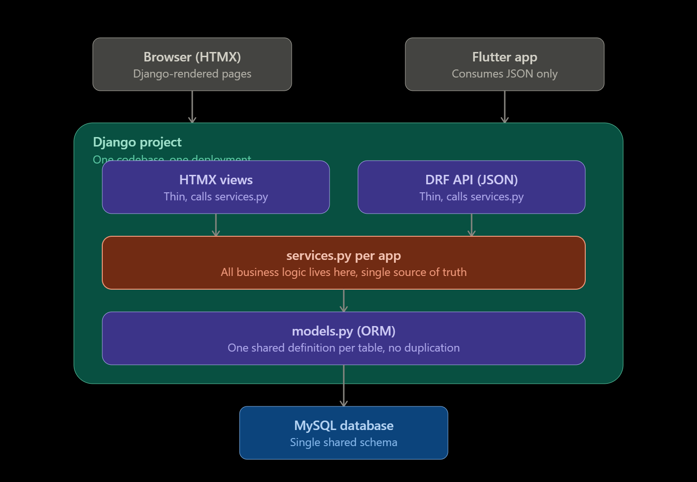

# BlueGriva — Project Boilerplate

Minimal Django + HTMX + Alpine.js + Tailwind + MySQL scaffold.
No features yet. This only proves the pipeline (URL -> view -> template -> Tailwind/HTMX) works.


## Setup

```bash
# 1. Virtual environment
python3.12 -m venv .venv
source .venv/bin/activate

# 2. Install dependencies
pip install -r requirements/dev.txt

# 3. Environment variables
touch .env
# create and edit .env with your local MySQL credentials and a real SECRET_KEY

# 4. Create the database
mysql -u root -p -e "CREATE DATABASE bluegriva CHARACTER SET utf8mb4;"


# 5. Migrate and run
python manage.py migrate
python manage.py runserver
```

Visit `http://127.0.0.1:8000/` — you should see a plain BlueGriva placeholder page.

## Project layout

```
config/             Django settings, root urls, wsgi/asgi
core/               BlueGriva apps one folder per feature area
templates/          Shared base template + per-app templates
theme/              Generated by `tailwind init` — Tailwind's own app, not hand-written
requirements/       Split by environment (base / dev / prod)
```

## Architecture
